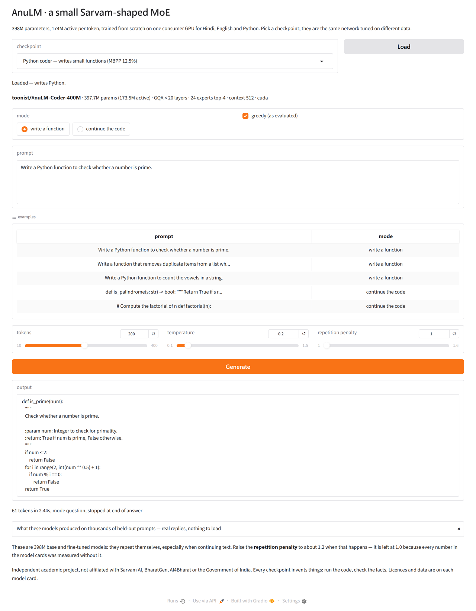

# AnuLM

[](https://github.com/MOBIRIZER-TECHNOLOGY/AnuLM/actions/workflows/tests.yml)

**AnuLM** (अणु, *anu*: atom, the smallest unit) is a small, **trainable**
mixture-of-experts language model carrying Sarvam 30B / 105B's
architecture, distilled from a line-by-line study of their released code,
and trained from scratch on one consumer GPU for Hindi, English and Python.
It ships the code, the data recipes, the experiment log, and five
checkpoints: a Python coder (MBPP 12.5% pass@1), an English ↔ Hindi
translator (chrF 41.5 / 43.4 on FLORES-200), a Hindi/English question
answerer, the three-language base the last two were fine-tuned from, and that
base continued at a 2,048-token context (§28 — better everywhere, though the
long-context part of it was mostly free).
`docs/MODEL_CARD.md` is the one-page summary of the coder, and there is a
card per checkpoint beside it; `CITATION.cff` says how to cite the project.

| checkpoint | Hugging Face | licence |
| --- | --- | --- |
| Python coder | [toonist/AnuLM-Coder-400M](https://huggingface.co/toonist/AnuLM-Coder-400M) | CC BY-NC-SA 4.0 |
| English ↔ Hindi translator | [toonist/AnuLM-Translate-400M](https://huggingface.co/toonist/AnuLM-Translate-400M) | CC BY-NC 4.0 |
| Hindi / English question answerer | [toonist/AnuLM-Hindi-QA-400M](https://huggingface.co/toonist/AnuLM-Hindi-QA-400M) | CC BY-SA 4.0 |
| three-language base | [toonist/AnuLM-Base-400M](https://huggingface.co/toonist/AnuLM-Base-400M) | CC BY-SA 4.0 |
| the same base at 2,048 tokens | [toonist/AnuLM-Base-2K-400M](https://huggingface.co/toonist/AnuLM-Base-2K-400M) | CC BY-SA 4.0 |

A fifth repo, [toonist/AnuLM-Smoke-30B](https://huggingface.co/toonist/AnuLM-Smoke-30B),
is not a model to use: it is a 17M checkpoint trained for 200 steps on
tinyshakespeare that exists to test the release pipeline end to end
(`docs/MODEL_CARD_SMOKE.md`).

Load any of them with `transformers` — the modelling code ships beside the
weights, so there is nothing to clone:

```python
from transformers import AutoModelForCausalLM, AutoTokenizer
m = AutoModelForCausalLM.from_pretrained("toonist/AnuLM-Coder-400M", trust_remote_code=True)
t = AutoTokenizer.from_pretrained("toonist/AnuLM-Coder-400M")
print(t.decode(m.generate(**t("def is_prime(n):", return_tensors="pt"), max_new_tokens=60)[0]))
```

Keep it in float32, which the config asks for by default: the router's
per-expert bias decides which experts fire, and rounding it to bfloat16
changes that and collapses the output into repeated tokens. `modeling_anulm.py`
warns if you force a 16-bit dtype.



Try it without installing anything: open
[demo_colab.ipynb in Colab](https://colab.research.google.com/github/MOBIRIZER-TECHNOLOGY/AnuLM/blob/main/demo_colab.ipynb),
run the three cells, pick a checkpoint, and a public link to the demo
appears (the free tier is enough). A Hugging Face Space would be the
same app, `app.py`, but Hugging Face now charges for hosting Gradio
Spaces, so none is up; the files are ready in `space/`. Want to help? [TODO.md](TODO.md)
lists the open work, several items need no GPU, and [CONTRIBUTING.md](CONTRIBUTING.md)
says how; each item is also a GitHub issue.

> Independent academic project, released for research and teaching. Not
> affiliated with or endorsed by Sarvam AI, BharatGen, AI4Bharat or the
> Government of India. The project was called *nanosarvam* until
> 2026-09-18. Two compatibility shims survive that rename and nothing
> else does: `model.py` keeps the old config class names as aliases, so a
> checkpoint pickled before it still unpickles, and `bpe.py` still loads a
> tokenizer file carrying the old format id, which is what the tokenizers
> beside the released weights say. Both are pinned by tests. The
> redistributed Sarvam code under `sarvam/` keeps its own name and Apache
> 2.0 licence. The code is MIT; each
> checkpoint carries the licence of its training data, see `NOTICE` §2.

Two things live in this repository:

1. **`sarvam/`** — Sarvam AI's open-weight modelling code (Sarvam 30B and
   105B, Apache 2.0, released February 2026), downloaded unmodified, plus five
   annotated walkthroughs of every non-obvious part. The reading.
2. **Everything else** — AnuLM itself: the same architecture at 1/1000th
   the size in pure PyTorch, no HuggingFace dependency, trained on Hindi,
   then on Hindi + English + Python, then fine-tuned to answer questions and
   to translate. The verification that the reading was understood.

```bash
python quickstart.py                 # checks this machine and says what to run next
python quickstart.py --train         # ... or just trains a 17M model now (~30 s GPU, 3-6 min CPU)
python quickstart.py --demo          # ... or downloads a released 400M model and serves it

pip install -r requirements.txt      # torch, safetensors; pyarrow only for the parquet converters
python test_model.py                 # 55 tests, ~2 min, no pytest needed
python model.py                      # shape + param sanity check, no data needed
python train.py --preset 30b         # GQA, high rope_theta  (Sarvam 30B's shape); downloads tinyshakespeare
python train.py --preset 105b        # MLA, YaRN-ready       (Sarvam 105B's shape)
python train.py --preset 350m --grad-ckpt   # 353M; needs a GPU
python sample.py --ckpt ckpt.pt --prompt "भारत"
python serve.py --ckpt ckpt_translate.pt    # a web page: continue text, answer a question, translate
python serve.py --ckpt ckpt_coder_sft.pt    # the Python coder: describe a function, or start one
python app.py   --ckpt ckpt_coder_sft.pt    # the same demo as a Gradio app (pip install gradio); what demo_colab.ipynb launches
```

New here? Run `python quickstart.py`: it reports what your install can and
cannot do, prints the exact command to fix anything missing, and offers to
train a model or download one. Then `docs/TUTORIAL.md` goes from an empty
machine to every checkpoint in this repository, with the time, disk and
number to expect at each step.

`30b` and `105b` run on CPU; `350m` needs a GPU (8 GB is enough with
`--grad-ckpt`; every 350M-class run here used an RTX 5050 and then an RTX
5070 Ti). If you have an NVIDIA card, install the CUDA wheel — the default
CPU wheel silently reports cuda unavailable.

| doc | what's in it |
| --- | --- |
| [docs/ARCHITECTURE.md](docs/ARCHITECTURE.md) | How Sarvam 30B/105B are built — MLA, GQA, sparse MoE, aux-loss-free routing, YaRN — and (§10) which of those choices held up when rebuilt and trained at nano scale. The research output. |
| [docs/RESULTS.md](docs/RESULTS.md) | Every experiment run here, with numbers: §1–21 the Hindi ladder, §22 three languages, §23 question answering in all three, §24 English ↔ Hindi translation (chrF 41.5 / 43.4 on FLORES-200), §25 the Python coder, finished: MBPP 12.5%, HumanEval 4.9%. |
| [docs/MODEL_CARD.md](docs/MODEL_CARD.md) | The finished Python coder on one page: every data source with its size and share, the architecture as read from the checkpoint, the training run, the benchmark numbers with the prompt mode that produced each, and how to try it. |
| The other cards: [base](docs/MODEL_CARD_BASE.md), [base at 2K](docs/MODEL_CARD_BASE2K.md), [question answerer](docs/MODEL_CARD_HINDI_QA.md), [translator](docs/MODEL_CARD_TRANSLATE.md) | One page each — what the checkpoint does and does not do, its data and licence, its numbers, how to run it. `export_hf.py` copies these into the Hugging Face repos, so the card on the Hub and the card here are the same file. |
| [docs/TUTORIAL.md](docs/TUTORIAL.md) | From a fresh machine to your own AnuLM: install, a first model in 20 min on CPU, then every real run in order with the time, disk, GPU and expected number for each. Start here. |
| [docs/DATASETS.md](docs/DATASETS.md) | Every data source with its link, licence, size, the script that fetches it and the checkpoint that used it; which licence each released checkpoint inherits. |
| [docs/DEVELOPING.md](docs/DEVELOPING.md) | Setup, layout, testing, how to extend, known gaps and gotchas. |
| [TODO.md](TODO.md), [CONTRIBUTING.md](CONTRIBUTING.md) | Open work, ordered by usefulness and labelled by whether it needs a GPU, and how to contribute a measured change. |
| [docs/PUBLISHING.md](docs/PUBLISHING.md) | How this is released: licences per artefact, weight export to safetensors, Hugging Face upload, Zenodo DOI, the Space. |
| [docs/ANNOUNCEMENT.md](docs/ANNOUNCEMENT.md) | Post drafts for LinkedIn and X, with a table giving the source of every number in them and honest answers to the questions a reader will ask. |
| [docs/TRANSLATE_PLAN.md](docs/TRANSLATE_PLAN.md), [docs/CODER_PLAN.md](docs/CODER_PLAN.md) | The two demo plans, with status: both finished. Translation is scored on FLORES-200; the coder ran its 700k steps, was instruction-tuned, and is served by `serve.py`. |
| [experiments/README.md](experiments/README.md) | One script per results section from §9 on, and how to resume the long ones. |
| [demo_colab.ipynb](demo_colab.ipynb), [app.py](app.py), [space/](space/) | The hosted demo: three cells in Colab that download a checkpoint and launch `app.py` with a public link, and the Space files for the day Gradio Spaces are free to host again. |
| [TASKS.md](TASKS.md) | The running to-do list for the two demos, the resume command for each step, and a live-status block that `update_tasks.py --loop 3600` rewrites hourly from the checkpoint on disk, so a power cut loses nothing but the last interval. |
| `sarvam/*_annotated.py` | The annotated Sarvam code, read beside `sarvam/sarvam-30b/` and `sarvam/sarvam-105b/`. |

|                     | total   | active/token | experts hold | layers | attention |
| ------------------- | ------- | ------------ | ------------ | ------ | --------- |
| `nano_30b`          | 17.44 M | 6.60 M (38%) | 71%          | 8      | GQA 6q/2kv |
| `nano_105b`         | 47.39 M | 13.33 M (28%)| 82%          | 12     | MLA        |
| `nano_350m`         | 353.3 M | 151.5 M (43%)| —            | 20     | GQA 16q/4kv |
| `350m` + combo `--cfg` | 364 M † | 140 M (38%) | —          | 20     | GQA 16q/4kv, window 256 on layers 0–9 |
| the same with the 32k head | 398 M | 174 M (44%) | —       | 20     | every released checkpoint: `ckpt_multi36k`, `ckpt_multi_qa`, `ckpt_translate`, `ckpt_coder_sft` |

`nano_350m` needs a GPU (8 GB is enough) and `--grad-ckpt`; it was sized by
measurement against an RTX 5050 — see `docs/RESULTS.md` §6. The other two run
anywhere.

The last row is not a preset but the configuration the ablations converged on
(`docs/RESULTS.md` §12): 24 experts of 192 instead of 12 of 384, top-4, no
shared expert, a 256-token window on the lower half of the layers, and
`bias_update_rate=3e-3` (§16). It matches the 12-expert preset's loss at
three-quarters of the active compute and is what the best checkpoints
(`ckpt_hindi_mixed18k`, and `ckpt_hindi_mixed36k` continued from it with
`--resume --steps 36000 --rewarmup 500`, §21) were trained with — the full
command is `experiments/run_long.sh`:

```bash
python train.py --preset 350m --grad-ckpt --moe-impl grouped \
    --data data/mixed.hi16k.bin --steps 18000 --batch-size 8 --block-size 512 \
    --lr 6e-4 --seq-balance-alpha 1e-4 --router-z-alpha 1e-3 \
    --cfg num_experts=24 moe_intermediate_size=192 num_experts_per_tok=4 \
          num_shared_experts=0 sliding_window=256 max_window_layers=10 \
          bias_update_rate=3e-3
```

† with the 16k BPE head, which is how every 350M-class model here was trained;
the preset's byte-vocabulary figure is 353 M / 152 M, and 386 M / 185 M with
the same head.

## Where each piece comes from

| AnuLM | real model | annotated in |
| --- | --- | --- |
| `GQAttention` | `SarvamMoEAttention` (30B :371) | `gqa_forward_annotated.py` |
| `MLAttention` | `SarvamMLAAttention` (105B :467) | `mla_forward_annotated.py` |
| `Router` | `MoEGate` (105B :267) / `SarvamMoEGate` (30B :196) | `moe_routing_annotated.py` |
| `MoE` | `SarvamMLAMoE` (105B :331) / `SarvamMoESparseMoeBlock` (30B :320) | `moe_routing_annotated.py` |
| `Rotary` + YaRN | `SarvamMLAYarnRotaryEmbedding` (105B :170) | `yarn_rotary_annotated.py` |
| `Block` / `AnuLM` | `SarvamMLADecoderLayer` (:645) / `SarvamMLAModel` (:721) | `decoder_and_model_annotated.py` |

The annotated files live in `sarvam/`; the line numbers are into
`sarvam/sarvam-30b/modeling_sarvam_moe.py` and `sarvam/sarvam-105b/modeling_sarvam_moe.py`.

## What is faithful

- **Sigmoid router, not softmax.** Experts are scored independently, which is
  what makes the bias trick below possible.
- **Aux-loss-free load balancing.** `Router.expert_bias` is a *buffer*, not a
  parameter — no gradient, no weight decay. `update_expert_biases()` nudges it
  by `±bias_update_rate` against each expert's load error after every optimizer
  step. Critically the bias steers *selection only*: combine weights are
  gathered from the unbiased scores, so balancing never enters the loss.
  Training logs `imbalance` (max load / mean load); it should fall toward 1.0.
- **Group-limited routing.** `n_group`/`topk_group` reproduce the 105B's
  constraint that all k experts come from a few groups. Presets mirror the real
  configs: `nano_30b` uses `n_group=1` (a no-op, like the real 30B), `nano_105b`
  uses 4 groups keeping 2. `__post_init__` rejects a top-k larger than the
  surviving groups can supply — a footgun the real code leaves unguarded.
- **Shared expert + dense layer 0.** `first_k_dense_replace=1`; the shared
  expert is always-on and added outside the routing.
- **MLA's compression.** One `kv_a_proj_with_mqa` producing a `kv_lora_rank`
  latent plus a single MQA-style rope key shared across heads; RoPE applied
  before expansion so the latent stays position-free.
- **QK-norm before RoPE**, RMSNorm, SwiGLU, pre-norm blocks, untied embeddings,
  fp32 router logits, fp32 loss.
- **YaRN** (`--yarn`): the NTK-by-parts band blend, with the temperature term
  applied to the attention scale rather than the rotary tables — exactly where
  the 105B puts it, and in both attention paths rather than only the MLA one.

## What is deliberately different

- **It trains.** The released 105B modelling file cannot: `assert not
  self.training` in the gate, `@torch.no_grad()` on `moe_infer`, no real
  training branch, and a model loop that never calls the gradient-checkpointing
  function. The MoE here dispatches with `index_select` + indexed assignment,
  which is differentiable, and avoids the 30B training path's up-front
  `repeat_interleave` of every hidden state.
- **Split-halves RoPE throughout.** The 105B checkpoint stores rope dims
  interleaved and permutes before rotating; training from scratch, we pick one
  convention and stay in it.
- **SDPA only.** No FlashAttention subclass, no vLLM branch, no expert
  parallelism. There *is* a KV cache (`generate(use_cache=True)`, the default):
  GQA caches its `n_kv_head` heads, MLA caches the `kv_lora_rank` latent plus
  the single rope key — the thing MLA exists for — and the tests hold both to
  the uncached path token-for-token, including after the window fills. Decoding
  is still launch-bound at this size (≈1,000 small kernels per token on the
  350M); the cache is worth ~1.35×, a compiler would be worth more.
- **Byte-level tokenizer by default**, 256 bytes + BOS/EOS/PAD, and a
  from-scratch BPE (`bpe.py`) for the real runs. Sarvam's real contribution
  at this layer is a 262,144-token tokenizer spanning 22 languages and 12
  scripts, whose low fertility on Indic text is a large part of why their
  models are cheap in those languages. Bytes are the honest placeholder —
  worst possible fertility, zero training cost — and the 16k Hindi and 32k
  three-script tokenizers trained here (`docs/RESULTS.md` §7, §22) are the
  nano version of that moat: 9.5 bytes per token on Hindi against 1.0.
- **Ratios drift at small scale.** The real models route 6/128 and 8/128 experts
  (≈5–6%); with 16 experts, top-2 is 12.5%. Top-1 would be degenerate. Sparsity
  is milder here than in the originals.

## Long-context extension: does YaRN earn its place?

```bash
python eval_context.py --ckpt ckpt_105b.pt     # rope_theta 1e4, YaRN's home turf
python eval_context.py --ckpt ckpt_30b.pt      # rope_theta 1e6, extrapolation instead
```

Both checkpoints were trained at `block_size=256` with plain RoPE. Evaluate them
at 2x and 4x that, either naively or with the rotary rebuilt for YaRN
(`factor = length/256`). Same weights, **zero fine-tuning at the longer length**.

| context | `nano_105b` naive | `nano_105b` YaRN | | `nano_30b` naive | `nano_30b` YaRN |
| --- | --- | --- | --- | --- | --- |
| 256 (trained) | 1.5368 | — | | 1.5212 | — |
| 512 | 1.7000 | **1.6516** | | **1.5871** | 1.6460 |
| 1024 | 2.3096 | **1.6989** | | **1.6650** | 1.6910 |

Loss by position inside a 1024-byte window tells the real story:

| positions | `105b` naive | `105b` YaRN | | `30b` naive | `30b` YaRN |
| --- | --- | --- | --- | --- | --- |
| 0–256 *(in-distribution)* | **1.5421** | 1.6802 | | **1.5076** | 1.6808 |
| 256–512 | 1.7924 | **1.6989** | | **1.6046** | 1.7052 |
| 512–768 | 2.8697 | **1.7034** | | **1.6861** | 1.6898 |
| 768–1024 | 3.0342 | **1.7131** | | 1.8616 | **1.6882** |

**For the 105b preset YaRN is the difference between working and not.** Naive
extension collapses — 1.54 → 3.03 as you walk out the window, the slow frequency
dims hitting phases they never saw in training. With YaRN the curve is nearly
flat: 1.68 → 1.71 across a 4x extension, no retraining.

**For the 30b preset YaRN is a net loss — but a close one.** `rope_theta=1e6`
already spreads the frequency ladder wide enough that naive extension degrades
gently (1.51 → 1.86), so there is less for YaRN to repair, and on average the
repair does not pay for itself: +0.059 at 512, +0.026 at 1024. What it does buy
is the same flat curve the 105b preset gets — it never leaves 1.68–1.71 across
the whole window, against naive's 1.51 → 1.86 — so it ties in the third quarter
and wins
outright in the fourth (768–1024: 1.6882 vs 1.8616).

That flatness is bought with in-distribution accuracy, in both models: at
positions 0–256 YaRN is *worse* than naive (1.68 vs 1.54, 1.68 vs 1.51). You are
trading accuracy on the range you trained for, in exchange for not falling apart
beyond it.

The 30b column was regenerated after a bug fix: `GQAttention` applied YaRN's band
blend but not its logit-temperature term (`mscale**2 = 1.296` at factor 4), which
`MLAttention` had all along. The earlier table measured the band blend alone. The
105b columns are unchanged and reproduce to the fourth decimal.

Which is exactly why Sarvam chose oppositely for the two real models — 30B at
`rope_theta=8e6` with `rope_scaling: null`, 105B at `rope_theta=1e4` with YaRN
factor 40. Two answers to one problem, and at nano scale each one wins on its
own model.

## The v4 recipe: documents, sampling, regularisers, a shared benchmark

Everything the experiment log said mattered most was data-side, so v4 is
mostly data-side. Each piece is a flag or a file, and each is tested.

- **Documents.** `fetch_hindi.py` now writes one article per document —
  title, blank line, body — separated by `DOC_SEP` (three newlines, defined in
  `bpe.py`). `bpe.py encode` (`BPE.encode_documents`) puts EOS after every
  document; EOS is the last id of the vocab, so a `--vocab 16384` tokenizer is
  16,384 ids *including* it and older tokenizer files need no change. Byte mode
  does the same with id 257. `generate(eos_id=...)` stops on it, and
  `sample.py` passes it whenever the checkpoint's vocab has the slot. The
  corpus files are LF on every platform (`newline="\n"`); the byte loader also
  normalises CRLF so old Windows-written corpora cost one byte per newline.
- **Sampling without replacement.** `WindowSampler` lays a grid of
  non-overlapping windows from a fresh random offset each epoch and visits
  them in a fresh random order — every token once per epoch, boundaries that
  move between epochs, and the state rides in `.last` so `--resume` continues
  the permutation. The old behaviour is `--sample-with-replacement`, kept for
  A/B runs. Evaluation draws its windows from a private generator reseeded per
  call: the *same* windows every eval, and eval no longer perturbs the training
  data order.
- **Router regularisers**, both off by default: `--seq-balance-alpha`
  (DeepSeek-V3's complementary sequence-wise loss, eqs. 17–20; they use 1e-4)
  and `--router-z-alpha` (ST-MoE's z-loss, 1e-3). They add to the training
  loss only; the log prints the LM loss and `aux` separately so runs stay
  comparable. The aux-loss-free bias rule is still the balancer.
- **Sliding window**: `--sliding-window W --max-window-layers K` windows the
  first K layers (Qwen2 semantics — the real 30B config carries
  `max_window_layers: 19` with no window set). Off by default; the tests check
  a token outside the window cannot move the output and that cached decoding
  agrees.
- **`make_bench.py` / `eval_bench.py`.** Own-val numbers cannot be compared
  across corpora or tokenizers. `make_bench.py` builds one fixed held-out file
  from a *differently seeded* dump sample and drops every document whose
  Devanagari signature appears in *any* training corpus — a plain substring
  probe missed articles the v1 scrubber had mangled and quietly favoured the
  v1 model by 0.05 bits/byte. `eval_bench.py` scores any list of checkpoints on
  it, each with its own tokenizer, in bits/byte and bits/char.
- **`filter_prose.py`** drops heading/list lines and list-shaped articles — the
  whole dump is a quarter infobox remnants and station lists, and a model
  trained on it emits them. **`eval_context.py`** now takes BPE checkpoints and
  `--device cuda`, so the long-context / YaRN study runs on the 350M models
  and on the sliding-window ablation.

Results: the recipe A/B is `docs/RESULTS.md` §9 (−0.022 bits/byte at matched
compute), the architecture ablations §10 (fine-grained experts −0.008, the
shared expert costs more than it gives at this scale), the data lever §11
(3.3× unique text, −0.007), the ablation winners combined §12 (same loss at
76% of the active compute), prose filtering §13 (a clean negative, +0.023 on
both benchmarks), the Wikisource out-of-register benchmark §14 (the ranking
transfers; the register gap is a flat 0.24 for everyone), and the sliding
window's long-context cost §15 (none — it extrapolates *better*),
`bias_update_rate` for fine-grained experts §16 (the imbalance is not costing
loss), and Wikisource as training data §17 (the register gap goes from 0.24 to
0.06 for +0.047 on Wikipedia), and that run at 3× the steps §18 (best on
both benchmarks; compute pays in proportion to how much of the data is new).
The Hindi model to build on: `ckpt_hindi_mixed36k.pt` — the combo preset
(364M / 140M active) on Wikipedia + Wikisource, 36k steps with a warm
restart at 18k, 0.5876 / 0.6479 bits/byte (§21). The three-language model:
`ckpt_multi36k.pt` (§22), which the translation and multilingual QA
checkpoints are fine-tuned from.

## Talking to it: `serve.py`

```bash
python serve.py --ckpt ckpt_hindi_mixed36k.pt        # continue text; then open http://localhost:8000
python serve.py --ckpt ckpt_multi_qa.pt              # + answer a question, in Hindi, English or about Python
python serve.py --ckpt ckpt_translate.pt             # + translate English ↔ Hindi
```

A stdlib HTTP server (no Flask) that loads one checkpoint and serves
`web/index.html`: a prompt box, sliders for length and temperature, a seed,
and example prompts. `GET /info` returns the model facts the page shows;
`POST /generate` takes `{prompt, max_tokens, temperature, top_k, seed, mode,
repetition_penalty}` and returns the completion, so anything else can call
it too. The MoE dispatch is chosen by device, not by what the checkpoint
was trained with — the grouped GEMM on CUDA, the portable `sparse` path on
CPU — so any checkpoint serves anywhere. The page shows the modes the
checkpoint supports: every checkpoint *continues the text*; one that
carries `qa_templates` (anything `finetune.py` wrote) offers *answer a
question*, which picks the template from the script and shape of the prompt
and decodes with a repetition penalty of 1.3; one whose templates include
the translation directions
offers *translate*, which picks the direction from the script, caps the
temperature at 0.3 and stops at the end of the sentence. Generation is
serialised behind a lock, since the GPU model is not re-entrant; expect
~15 tok/s at batch 1, which is the launch-bound decode ceiling in
`docs/RESULTS.md` §9, not the server. Remember what the base mode is: a
model that continues text. A question comes back as the article or story
that would follow those words, fluent and fictional.

## Answering questions: `finetune.py`

```bash
python make_qa.py                                        # 56k pairs from the corpus's lead sentences
python finetune.py --ckpt ckpt_hindi_mixed18k.pt --out ckpt_hindi_qa.pt --epochs 2 --grad-ckpt
python eval_qa.py ckpt_hindi_mixed18k.pt ckpt_hindi_qa.pt --device cuda
python serve.py --ckpt ckpt_hindi_qa36k.pt               # the page gains an "answer a question" mode
```

Supervised fine-tuning with the only instruction data the project can make
for itself: for every Wikipedia article, a question about its title
(`X क्या है?`, `X के बारे में बताइए।`, …) and the article's lead sentence as
the answer, formatted `प्रश्न: …\nउत्तर: …<EOS>`. Examples are packed into
`block_size` rows and the prompt is masked to `-1`, so the loss lands on
answer tokens only; everything else is `train.py`'s loop. Fifteen minutes on
the 5070 Ti. On held-out questions the tuned model names the subject asked
about 86% of the time (base: 12%), triples token F1, and picks the right
answer from four 51% of the time (base 43%, chance 25%) — it learns the
format completely and few new facts, and doubling the pretraining under it
(`ckpt_hindi_qa36k`, from `ckpt_hindi_mixed36k`) moves that last number by
one point. `docs/RESULTS.md` §20–21. The checkpoint carries `qa_templates`,
keyed by language, which `serve.py`, `eval_qa.py` and `eval_translate.py`
read; `finetune.py` takes any jsonl of `{question, answer, lang}` pairs, so
the same script does the English and Python questions below and the
translation pairs after them, and it has `--stop-at` / `--resume` for runs
longer than a sitting.

## Fine-tuning one of these instead of training your own

```bash
python finetune.py --ckpt AnuLM-Base-400M --qa my_pairs.jsonl --heldout my_heldout.jsonl \
                   --out ckpt_mine.pt --lora --epochs 1 --lr 2e-4
python lora.py merge ckpt_mine.pt ckpt_mine.full.pt      # an ordinary checkpoint again
```

`finetune.py` takes any JSONL of `{question, answer, lang}` and trains with
the loss on the answer tokens only. `--lora` freezes the checkpoint and
trains a rank-16 correction on the attention projections instead: **1.5M
trainable parameters of 397.7M**, gradients and optimizer state down from
~4.8 GB to ~18 MB, and what you keep afterwards is a **6 MB adapter** rather
than another 1.6 GB checkpoint. B starts at zero, so the adapted model begins
as the base one did; merging folds the correction back into the weights and
gives an ordinary AnuLM that `serve.py` and `export_hf.py` load unchanged.
Not QLoRA -- the base stays float32, because this model's router does not
survive 16-bit weights. `docs/TUTORIAL.md` §12 has the comparison table.

## Three languages: Hindi, English, Python

```bash
bash experiments/build_multi.sh      # 2.1 GB corpus, 32k tokenizer, .bin (20 min on CPU)
bash experiments/run_multi.sh        # ckpt_multi36k: same preset and budget as ckpt_hindi_mixed36k (4 h)
bash experiments/run_qa_multi.sh     # ckpt_multi_qa: 37.5k question-answer pairs across the three (10 min)
```

The Hindi corpus plus 523 MB of English (Wikipedia and C4) and 257 MB of
Python (codeparrot-clean), a 32k BPE trained on a sample of all three, and
the §21 run's exact recipe on it: 36k steps, 148M tokens, half an epoch.
Same budget, three scripts. `docs/RESULTS.md` §22. The 16k Hindi tokenizer
spent 2.1 bytes per token on English and 1.5 on Python; the 32k one spends
4.3 and 4.4 while giving up 1% on Hindi, and the model it feeds scores
1.54 bits/byte on held-out English and 1.08 on Python where the Hindi-only
model, read through its own tokenizer, scored 2.30 and 3.77. The price is
paid in Hindi: 0.645 / 0.717 bits/byte on the two Hindi benchmarks against
0.588 / 0.648, because the same 148M-token budget now holds 64M Hindi
tokens instead of 148M. Then the QA recipe in all three languages at once
(20k Hindi pairs, 6.7k English, 10.8k Python write/explain pairs from
documented functions; §23): the tuned model names its subject 65 / 70 / 52%
of the time in Hindi / English / Python, and on Python it picks the right
function from four 72% of the time (base 45%).

## Translation: English ↔ Hindi

```bash
bash experiments/translate_build.sh          # 2M sentence pairs, both directions, + FLORES-200 devtest
bash experiments/translate_train.sh 25000    # fine-tune ckpt_multi36k to step 25k and exit
bash experiments/translate_train.sh          # resume from ckpt_translate.pt.last to the end (61,672 steps)
bash experiments/translate_eval.sh           # chrF on FLORES, 300 sentences per direction
python serve.py --ckpt ckpt_translate.pt     # the page gains a "translate" mode
```

Two million sentence pairs from Samanantar and the IIT Bombay corpus,
filtered for length, script and duplicates, each used in both directions as
`English: …\nHindi: …<EOS>` and the reverse, with the loss on the target
sentence only — the same `finetune.py`, from the three-language base. One
pass is 61,672 steps, six hours of GPU in three resumable calls; held-out
answer loss 4.05 → 2.30, a new best at every eval to the last. On
FLORES-200 devtest, all 1,012 sentences per direction, the finished
checkpoint scores **chrF 41.5 English → Hindi and 43.4 Hindi → English**,
where the untuned base scores 0.1 / 3.1 and NLLB-600M about 55.
`docs/RESULTS.md` §24 has the curve, the samples and the reference points.

## Toward a coder

```bash
bash experiments/coder_fetch.sh          # ~15 GB of Python, English, exercises, tests
bash experiments/coder_build.sh          # convert, mix 65/30/5, code32k tokenizer, encode
bash experiments/coder_train.sh 700000   # pretrain to step N and exit; rerun to continue (48 h)
EX_CAP=0 bash experiments/coder_sft.sh    # instruction-tune on all 1.38M pairs, then pass@1 (7.7 h)
python eval_code.py ckpt_coder_sft.pt --bench mbpp --device cuda
python serve.py --ckpt ckpt_coder_sft.pt  # the demo, at http://127.0.0.1:8000
```

`docs/MODEL_CARD.md` is the one-page summary of the finished checkpoint.

`docs/CODER_PLAN.md` is the week-long plan for a Python-writing checkpoint
of this architecture: 700k steps over a 2.78B-token corpus that is 65%
Python, then instruction tuning on exercise-style pairs and pass@1 on
HumanEval and MBPP (`eval_code.py`, which executes what the model writes).
**Finished 2026-09-15.** 700,000 steps over 2.87B tokens (one pass, 48 h
of GPU), val 2.7222, then instruction-tuned on 1.38M pairs:

| | base | instruction-tuned |
| --- | --- | --- |
| HumanEval pass@1 | **4.9%** (8/164) | 3.0% continuing / 0.0% asked |
| MBPP pass@1 | 0.0% | **12.5%** (32/257) |

For scale, CodeParrot-110M reaches ~4% on HumanEval after 25B tokens; this
reaches 4.9% after 2.87B. `docs/RESULTS.md` §25 has the full curve, the
samples, and why the tuned model's HumanEval zero was a prompting artifact
worth 3 points. The run belonged to a scheduled task that restarted it
through crashes and power cuts; `TASKS.md` is the recovery procedure.

## Accuracy: the golden set

```bash
python make_golden.py                                   # 600 cloze items from the benchmark files
python eval_golden.py ckpt_hindi_mixed18k.pt ckpt_hindi_full.pt --device cuda
```

bits/byte measures compression, not correctness. `golden/golden_hindi.jsonl`
is 600 Hindi cloze items — a prose prefix, a blanked content word, the word
that is actually there — drawn one per document from the held-out benchmark
files, half Wikipedia and half Wikisource, half with the answer already in
the passage and half without. `eval_golden.py` reports exact match on greedy
decoding and 4-way multiple choice against frequency-matched distractors
(chance 25%). The best checkpoint scores 11.2% / 85.8%; the Wikipedia-only
model 6.3% / 76.7%, with the whole gap on literature. `docs/RESULTS.md` §19
has the breakdown. Both scripts handle BPE and byte checkpoints, and the
scorer takes any JSONL with the same four fields, so a question-answering
set is a builder away.

## Tests

```bash
python test_model.py        # 55 tests, ~2 min, no pytest needed
```

They target what training would not catch. A leaky causal mask still converges,
it just cheats; broken RoPE still converges, it just loses long-range structure.
So: rewriting future tokens must not move past logits (and
`∂loss[t]/∂embedding[t+1]` must be exactly 0.0); `q·k` after RoPE must depend
only on `i-j`; the sparse dispatch must equal a naive per-token loop; gradient
accumulation must equal one big batch; checkpoints must round-trip bit-exactly.

One test failed usefully. An early version asserted that the load balancer
improves monotonically. It does not, and it never promised to — `sign()` applies
a full-size step however small the error, so it oscillates around the fixed
point (measured: 1.188x ↔ 1.734x, period 2, at `rate=0.05` on a frozen batch).
Direction is correct on every step. The tests now check that contract, plus
recovery from a deliberately collapsed router. A second failure was pure budget:
a skew of `S` closes at `2*rate` per step, so **recovery needs ~`S/(2*rate)`
steps before routing can change at all** — skew 3.0 at rate 0.01 shows literally
zero movement in 120 steps. Worth knowing before you raise `bias_update_rate`
because imbalance looks stuck.

## torch.compile and `moe_impl`

Sparse MoE dispatch uses `nonzero`, whose output shape is data-dependent, so
Dynamo cannot capture it: **9 graphs, 8 breaks per forward**. Setting
`torch._dynamo.config.capture_dynamic_output_shape_ops` does not help. Hence
`moe_impl`:

| | eager speed | Dynamo | equivalence |
| --- | --- | --- | --- |
| `sparse` (default) | **1.0x** (CPU fp32) | 9 graphs, 8 breaks | — |
| `dense` | 2.1–2.35x slower | **1 graph, 0 breaks** | bit-identical (0.00e+00) |
| `grouped` | **1.48x faster on GPU** (bf16 only) | **1 graph, 0 breaks** | bf16-exact vs sparse under autocast |

`dense` runs every expert on every token and combines through a one-hot weight
matrix — `num_experts/top_k` times the expert FLOPs, but static shapes
throughout. `grouped` sorts the `(token, slot)` pairs by expert once and runs
*all* experts as one `F.grouped_mm` per projection (`argsort` + `scatter_add` +
`cumsum` have static output shapes; `bincount` does not, and was the last graph
break). On the 350M it measured 11.9k vs 8.0k tok/s against `sparse`, with a
steady 328 ms/step where `sparse` jittered 330–560 ms — the jitter is
`nonzero`'s device sync, once per expert per layer. It is bf16 by the kernel's
contract, so it belongs under autocast; on CPU in fp32 `sparse` still wins.
`sparse` stays the default because it is what runs anywhere; `train.py` and
`sample.py` take `--moe-impl grouped`, and `sample.py` picks it on CUDA
automatically (the dispatch is not part of the weights, so any checkpoint can
decode with it). All three are tested for equivalence, and the graph-break
counts are asserted so the docs cannot drift.

Not verified here: **Inductor**. It generates C++ and needs a host compiler
(MSVC `cl` on Windows), which this machine lacks, so the compile tests use the
`aot_eager` backend — that still exercises Dynamo tracing and AOTAutograd, which
is where the model-specific risk lives. `train.py --compile` probes the backend
with a throwaway forward and falls back to eager with a one-line message rather
than dying mid-run. (An earlier version of this note said no GPU had been
available; that stopped being true at `docs/RESULTS.md` §6 — every 350M-class
run since has used bf16 autocast, fused AdamW and `--moe-impl grouped` on an
RTX 5050 and then an RTX 5070 Ti. Inductor is still the one untested path.)

## Knobs worth turning

```bash
python train.py --preset 105b --yarn        # band-blended RoPE for extension runs
python train.py --preset 30b  --grad-accum 4 --batch-size 8
python train.py --preset 350m --grad-ckpt --moe-impl grouped \
                --data data/hindi_v4.hi16k.bin \
                --seq-balance-alpha 1e-4 --router-z-alpha 1e-3     # the v4 recipe
python eval_bench.py ckpt_hindi_v3.pt ckpt_hindi_v4.pt            # shared benchmark
python train.py --preset 350m --grad-ckpt --optimizer muon         # 12 vs 16 bytes/param, 2.6x slower here
python train.py --preset 350m --cfg num_shared_experts=0 num_experts=24 moe_intermediate_size=192
```

In `AnuLMConfig`, reachable from the command line as `--cfg key=value`:
`bias_update_rate` (raise it if `imbalance` stays high, lower it if routing
oscillates; 3e-3 for 24 experts, see `docs/RESULTS.md` §16 — and note 1e-2
made balance *worse*), `num_experts_per_tok`, `n_group`/`topk_group`,
`routed_scaling_factor`, `num_shared_experts=0` to see what the shared expert
was doing for you (at 386M: nothing, §10), `sliding_window`/`max_window_layers`.
`--optimizer muon` trades two AdamW moments for one momentum buffer; on this
many small expert matrices it is a memory knob, not a speed one (§6).

## Results

Three runs, CPU (torch 2.14.0+cpu), batch 16 × block 256, tinyshakespeare,
identical seed and data order.

| | `nano_30b` | `nano_30b` | `nano_105b` |
| --- | --- | --- | --- |
| attention | GQA | GQA | MLA |
| params total / active | 17.44M / 6.60M (38%) | 17.44M / 6.60M | 47.39M / 13.33M (28%) |
| steps | 1000 | 600 | 600 |
| **val loss** | **1.5190** | 1.5701 | 1.5467 |
| bits/byte | 2.192 | 2.265 | 2.231 |
| wall clock | 1345 s | **921 s** | 1781 s |
| throughput | 3000 tok/s | 2692 tok/s | 1393 tok/s |
| imbalance peak → final | 5.19× → 1.16× | 3.35× → 1.18× | 7.02× → **1.13×** |

At **matched steps** (600) MLA wins: 1.5467 vs 1.5701, worth 0.034 bits/byte —
which it should, carrying 2× the active parameters. At **matched wall clock**
GQA wins outright: it reaches a *better* loss (1.5190) in *less* time (1345 s)
than the MLA preset needs for 1.5467. That is the trade the two real models
make, and at this scale on CPU it lands the same way round.

Group-limited routing (105b: 4 groups, keep 2) makes balancing visibly harder —
it peaks higher (7.02× vs 3.35×) and stays imbalanced longer, since half the
experts are unreachable for any given token — but it finishes *lowest* of the
three at 1.13×. The constraint slows the balancer without defeating it.

## Status: trained and verified

`nano_30b`, 1000 steps, 22 min:

```
step    0 | loss 5.5869 | imbalance 4.43x
step   50 | loss 2.7887 | imbalance 5.19x     <- peak
step  250 | loss 1.6047 | imbalance 1.77x
step  500 | loss 1.3917 | imbalance 1.53x
step  999 | loss 1.2182 | imbalance 1.16x
eval @ 999 | val loss 1.5190 | bits/byte 2.192
```

**The load imbalance rises before it falls**, and that is the interesting
result. At `bias_update_rate=1e-3` the bias can only move ±0.05 in 50 steps,
against sigmoid scores spanning (0,1) — so early on the router collapses toward
favourite experts faster than the correction can push back. Past ~step 100 the
accumulated bias overtakes that drift and load converges to near-uniform
(1.16×, where 1.0 is perfect). If you shorten the run, do not read the early
climb as a broken balancer; if you need it to bite sooner, raise
`bias_update_rate`.

Sample at val 1.519 (`--temperature 0.8`):

> KING RICHARD II: / You speak the country of your blood / As oath the children
> courted with thee. / Come, whence thou consents of your perpares, ...

Also verified: both presets forward *and* backward (`python model.py`);
parameter counts match the analytical table exactly; group-limited top-k and the
MoE dispatch/combine index math checked against naive reference implementations
(exact match, every slot written once, weights summing to
`routed_scaling_factor`).

One expected quirk in `python model.py` (which seeds per preset, so these
numbers reproduce): `nano_30b` reports 45 parameters without gradients. That is
not a bug — with only 2×64 tokens, 15 of the 112 experts across its 7 MoE layers
receive no tokens at all in that batch and correctly get no gradient, 3 weights
each (`gate_proj`, `up_proj`, `down_proj`). `nano_105b` reports 0, and so does
`nano_30b` at realistic batch sizes.

## Licence and provenance

The code here is MIT (`LICENSE`). The redistributed Sarvam files and the
training-data terms are recorded in `NOTICE`, which is the file to read
before any commercial use — **two of the translation corpora are
non-commercial, and `ckpt_translate` is trained on them.**

Sarvam's models and code are Apache 2.0. The files under `sarvam/sarvam-30b/`
and `sarvam/sarvam-105b/` are theirs, downloaded unmodified from
`sarvamai/sarvam-30b` and `sarvamai/sarvam-105b` on Hugging Face; their
headers and licence apply. Everything else here — the annotations, the model,
the training and evaluation code, the documents — was written from scratch
for this study. **No Sarvam weights are used or redistributed.** AnuLM
is a re-implementation of published architecture, in the same sense that
nanoGPT is a re-implementation of GPT-2. The training data are public:
Wikimedia dumps, C4, codeparrot-clean, fineweb-edu, code_exercises,
OpenCodeInstruct, glaive-code-assistant, Samanantar, the IIT Bombay
English-Hindi corpus, FLORES-200, HumanEval and MBPP, each under its own
licence; none is redistributed here (`data/` is gitignored).
